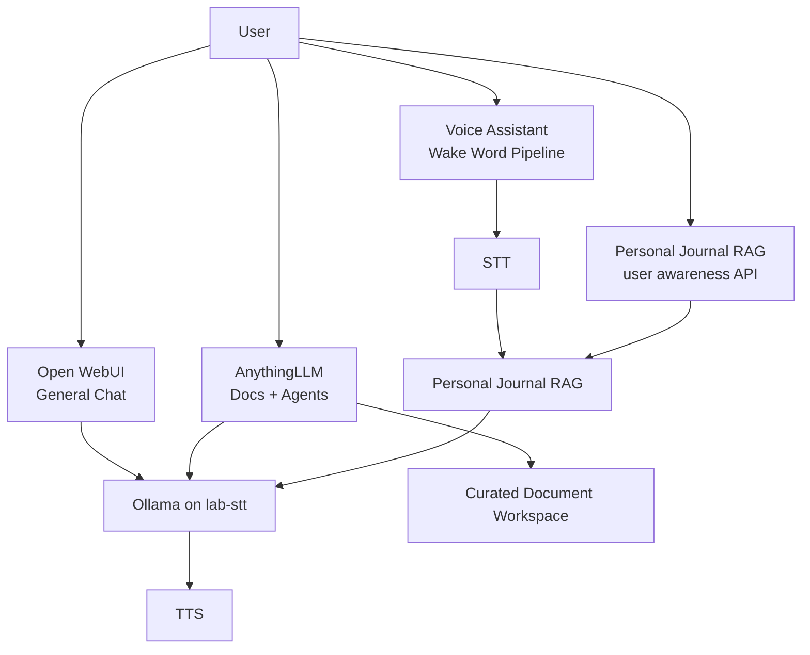

**Summary:** In my home AI lab, I’m adding AnythingLLM not because I needed another chatbot, but because I wanted to dogfood the same architecture patterns I evaluate professionally: context boundaries, RAG, agents, model routing, and operational ownership. This ADR captures how I’m using the lab as a practical proving ground for turning AI capability into intentional system design.

<!--more-->

# ADR: Choosing AnythingLLM as the Document and Desktop Agent Layer for Resonance Lab

## Status

Proposed

## Decision

I am adopting **AnythingLLM Desktop** as the document knowledge-base and desktop agent layer for **Resonance Lab**.

This does **not** replace my existing local AI stack. Instead, it adds a new interaction layer focused on curated documents, workspace-based knowledge, and desktop agents.

In practical terms:

- **Open WebUI** remains my general-purpose local chat interface.
- **Ollama** on `lab-stt` remains the model runtime.
- **lab-stt** remains the primary AI server for STT, TTS, RAG, Ollama, and Open WebUI.
- **My personal journal RAG service** remains the fit-for-purpose personal insight layer.
- **AnythingLLM** becomes the focused document and agent workspace for curated lab knowledge.

## Why this decision matters

Resonance Lab has grown from a simple voice and transcription setup into a small local AI platform.

Today, the lab already includes:

- speech-to-text
- text-to-speech
- local LLM inference
- a personal journal RAG service
- document retrieval
- Open WebUI for browser-based chat
- curated architecture and runbook documentation

The gap was not:

> Can I ask local AI questions?

I already could.

Open WebUI gives me general local chat. The voice pipeline gives me ambient interaction. The personal journal RAG gives me fit-for-purpose user awareness over structured and semantic journal memory.

The remaining gap was different:

> Can I reason across curated architecture docs, runbooks, project notes, and operational knowledge in a desktop workspace designed for documents and agents?

That is the role I want AnythingLLM to play.

## Current architecture context

The current Resonance Lab architecture is centered around `lab-stt` as the primary AI host. It runs STT, TTS, RAG, Ollama, and Open WebUI. The Raspberry Pi handles the voice-listener role, and the Jetson node is currently positioned around OCR and vision-related services.

At a high level, the existing voice assistant path looks like this:

<a href="/images/voice-assistant.png" target="_blank">
  
</a>

Voice assistant architecture.

AnythingLLM enters as a separate, document-first interaction layer:

<a href="/images/anything-llm.png" target="_blank">
  
</a>

### The idea:

```text
Open WebUI           = fast general chat
Personal Journal RAG = fit-for-purpose personal memory & intent routing
AnythingLLM          = curated document reasoning and desktop agents
Voice stack          = existing automated STT/RAG/LLM/TTS pipeline
```

## Existing personal journal RAG model

Before adding AnythingLLM, Resonance Lab already had a working personal journal RAG model.

This service is intentionally purpose-built. It answers personal-data questions grounded in journal-derived structured CSV outputs, semantic journal memory, synced documents, and session context.

It runs as a FastAPI application on `lab-stt:8002` and uses:

* SQLite for structured retrieval
* ChromaDB for semantic retrieval
* `nomic-embed-text` for embeddings
* Ollama/Qwen for generation
* session memory for multi-turn context

The current implementation supports structured, semantic, hybrid, document, and refusal modes.

That distinction matters.

The journal RAG model is not a generic desktop document assistant. It is a fit-for-purpose personal-data reasoning service.

It knows how to answer questions like:

* “How many days did I hit my steps goal?”
* “When did I last feel drained?”
* “On days I worked out, how did that impact my mood?”
* “Given my recent reflections, what should I prioritize this week?”

It combines structured journal data, semantic free-text recall, synced documents, and multi-turn session memory to maintain what the system documentation describes as a “sense of me” across a conversation.

The system also has an important refusal contract. When no relevant data is retrieved, or when the question is out of scope, it returns a refusal response rather than fabricating personal facts. In that case, the service does not call the LLM.

This is why AnythingLLM is being added as an augmentation layer, not as a replacement.

The existing journal RAG remains the personal insight and voice-context layer. AnythingLLM becomes the document workspace and desktop-agent layer. Open WebUI remains the general chat layer. These tools overlap at the edges, but they serve different jobs.

```text
Personal Journal RAG = user awareness & intent routing, structured/semantic journal retrieval, personal context
AnythingLLM          = curated document workspace and desktop agents
Open WebUI           = general-purpose local chat
Voice pipeline       = ambient interaction path
```

In the current iteration, this separation is intentional. The journal RAG model already handles sensitive personal retrieval, session memory, request tracing, and refusal behavior. AnythingLLM is being introduced to make curated architecture docs, runbooks, project notes, and operational knowledge easier to explore through a desktop-first document and agent interface.

## Updated functional architecture

<a href="/images/functional-architecture.png" target="_blank">
  
</a>

## Why AnythingLLM

AnythingLLM fits this iteration because it is explicitly built around document chat, RAG, and AI agents. It is not itself the model runtime; it sits above runtimes like Ollama and organizes interaction around documents, workspaces, and agents.

That matters because my lab already has the lower-level pieces:

* model serving through Ollama
* curated documents
* a local network
* separate services for STT, TTS, RAG, and Open WebUI
* a personal journal RAG model for user awareness

What I wanted was a practical workspace layer on top.

AnythingLLM gives me a way to create a focused knowledge base like:

> Resonance Lab Knowledge Base

and then use it to ask questions such as:

* “How does my voice pipeline work?”
* “What services run on lab-stt?”
* “What are the recovery steps for TTS?”
* “Compare my current architecture to the direction I documented in future plans.”
* “Create an operator-facing summary of this runbook.”

That is different from a generic chat prompt. It is a workspace over a curated body of knowledge.

## Products evaluated

### AnythingLLM

AnythingLLM is the selected option for this iteration.

I chose it because it is strongly aligned to:

* document-centered workflows
* local-first usage
* workspace organization
* agent-style interaction
* fast single-user desktop experimentation

It fits the way I am currently evolving the lab: lightweight, local, iterative, and centered on learning by building.

### Open WebUI

Open WebUI remains part of the architecture, but not as the answer to this specific problem.

I already use it as the general chat interface on `lab-stt`. It is useful when I want a fast browser-based way to talk to local models. I do not want to replace that.

The distinction is simple:

```text
Open WebUI   -> general chat interface
AnythingLLM -> document workspace and desktop agent layer
```

### Personal Journal RAG

The personal journal RAG service was not rejected. It is retained.

It already does the job it was built to do: grounded user awareness over structured journal data, semantic memory, synced documents, and session context.

The decision is not “AnythingLLM versus my journal RAG.”

The decision is:

```text
Journal RAG remains the personal-memory system.
AnythingLLM becomes the document workspace system.
```

### LibreChat

LibreChat is a strong option for a multi-provider chat control plane.

For this iteration, that is more than I need. My immediate goal is not enterprise-style multi-provider chat management. It is a focused document workspace for my lab.

### Jan

Jan is attractive as a local-first desktop chat assistant.

For this decision, though, I wanted the document and workspace model to be the center of gravity. Jan is closer to a local assistant experience, while AnythingLLM is closer to a document knowledge-base experience.

### Dify

Dify is powerful, but it feels like the next layer up.

If I were building production AI workflows, visual pipelines, and app-like AI services, Dify would be a serious candidate. For this iteration, I want to keep the surface area smaller and focus on document reasoning and desktop agents.

## Key design decision

The key design decision is to treat AnythingLLM as an **augmentation layer**, not as a replacement.

That means:

* I am not replacing Open WebUI.
* I am not replacing my voice assistant.
* I am not replacing my personal journal RAG model.
* I am not replacing my custom RAG service.
* I am not moving STT or TTS into AnythingLLM.
* I am not making Jetson a dependency for this workflow.

AnythingLLM becomes another doorway into the lab.

A better doorway for documents.

## Deployment choice

For now, I am using the desktop version of AnythingLLM on Pangolin.

That matches the current use case:

* single-user
* local experimentation
* desktop-oriented workflow
* fast iteration
* minimal infrastructure overhead

The backend services remain on `lab-stt`:

```text
Ollama endpoint:       http://10.0.100.10:11434
Embedding model:       nomic-embed-text
Generation models:     Qwen / Qwen Coder models via Ollama
Open WebUI endpoint:   http://10.0.100.10:3000
Personal RAG endpoint: http://10.0.100.10:8002
```

The initial embedding backend is also `lab-stt`, not Jetson. I tested Jetson as an embedding node, but for now I prefer the simpler and more stable path.

## Document strategy

The important design constraint is curation.

I do **not** want to point this at my entire `~/Documents` directory.

That would create a noisy retrieval space.

Instead, I am using curated document sets:

```text
CuratedDocuments/
└── resonance-lab/
    ├── architecture docs
    ├── service docs
    ├── network docs
    ├── runbooks
    ├── ADRs
    └── selected supporting notes
```

The workspace should be a clean knowledge base, not a filesystem vacuum.

For larger or more complex files, I am also creating embedding-friendly companion files. For example, I created an ARM template summary companion that explains what the template deploys, what parameters drive it, and what resource categories it includes, rather than relying only on dense raw JSON.

## Expected benefits

This decision gives me:

* a focused document workspace
* a place to experiment with desktop agents
* better separation between chat, documents, personal memory, and voice automation
* a cleaner way to reason about my lab architecture
* a practical tool for lifelong learning around local AI systems

The biggest shift is not technical.

It is conceptual.

I am moving from:

```text
I have tools that answer questions.
```

to:

```text
I have layers of interaction for different kinds of thinking.
```

## Tradeoffs

This does add another layer.

That means I need to be clear about boundaries:

| Layer                   | Role                                                                     |
| ----------------------- | ------------------------------------------------------------------------ |
| Open WebUI              | general-purpose local chat                                               |
| Personal Journal RAG    | personal memory, user awareness, structured and semantic journal retrieval |
| AnythingLLM             | document workspace and desktop agents                                    |
| Existing voice pipeline | ambient STT/RAG/LLM/TTS interaction                                      |
| Ollama                  | local model runtime                                                      |
| lab-stt                 | primary AI service host                                                  |
| Jetson                  | OCR / vision node                                                        |

There is overlap between these systems, but I am accepting that overlap because the interaction models are different enough to justify each layer.

## Risks

The main risks are:

1. **Tool sprawl**  
   I now have another interface in the lab.

2. **Retrieval quality depends on curation**  
   Bad document hygiene will create bad answers.

3. **Desktop-first may not scale**  
   If this becomes a multi-user system, I may need to revisit deployment.

4. **Agent expectations can exceed reality**  
   Agent mode is useful, but I should treat it as an experimental assistant, not an autonomous operator.

5. **Model choice matters**  
   Fast coder models are good for quick lookup. Heavier Qwen models are better for reasoning. I need to switch intentionally based on task.

6. **Layer boundaries need discipline**  
   The personal journal RAG should remain the trusted user awareness layer. AnythingLLM should not become an accidental replacement for that purpose-built system.

## Consequences

The near-term consequence is that Resonance Lab now has four distinct interaction paths:



That gives me a cleaner architectural separation:

```text
Chat when I want conversation.
Journal RAG when I want user awareness.
Docs when I want grounded operational knowledge.
Voice when I want ambient interaction.
```

## Decision outcome

I am proceeding with AnythingLLM Desktop as the document and desktop-agent layer for the current iteration of Resonance Lab.

This is an additive decision.

It keeps the existing lab architecture stable while creating a new space for document-centered reasoning, agent experimentation, and local AI learning.

## Acronyms and contextual definitions

* **ADR** — Architecture Decision Record. A short document that captures a design decision, its context, and its consequences.
* **AI** — Artificial intelligence. In this post, mostly local language-model and retrieval tooling.
* **LLM** — Large language model. In Resonance Lab, this usually means Qwen-family models running through Ollama.
* **Ollama** — The local model runtime used by the lab.
* **Open WebUI** — The existing browser-based local chat interface running on `lab-stt`.
* **AnythingLLM** — The selected document workspace and desktop-agent layer.
* **RAG** — Retrieval-augmented generation. A pattern where relevant documents or records are retrieved and passed into the model as context.
* **Personal Journal RAG** — My fit-for-purpose personal-memory service for structured journal data, semantic journal recall, synced documents, and session memory.
* **STT** — Speech-to-text. The lab’s transcription service.
* **TTS** — Text-to-speech. The lab’s speech output service.
* **OCR** — Optical character recognition. Used in the lab for extracting text from images and video.
* **Jetson** — The lab’s NVIDIA edge device, currently used around OCR and vision workloads.
* **Pangolin** — The System76 desktop/workstation where AnythingLLM Desktop is being used.
* **lab-stt** — The primary AI server in Resonance Lab.