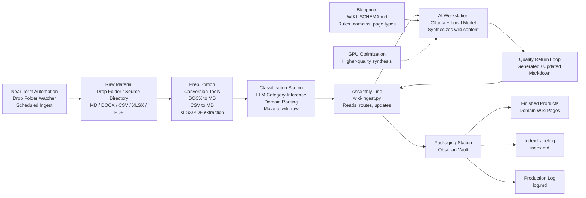

**Summary:** I've been working through a better way to manage personal and project knowledge in the homelab, with an eye on enterprise use of AI that is precise, cost effective and applicable to automation. Think "lawfirms" or "architecure review boards," you'll get the idea. Most document AI workflows still feel like rummaging through a warehouse in the dark - you upload files, ask a question, and the model retrieves chunks at query time. That works, but it's limited. Nothing compounds unless I manually turn answers into durable notes. This post walks through the pattern I'm using to fix that, the current state of the build, and the automation plan from here.

> Note: This is a homelab pattern, not a product pitch... yet. Everything here runs locally on Ollama and Obsidian. You could implement the same shape with any local model runner, or metered cloud LLM service, and any Markdown-native notes tool.

<!--more-->

# From RAG to a Knowledge Factory: An LLM-Owned Wiki That Compounds
*From query-time retrieval to a maintained, source-grounded knowledge base*

## Overview

The better pattern - what I'm calling the **[Karpathy Pattern](https://gist.github.com/karpathy/442a6bf555914893e9891c11519de94f)** - is to let the LLM build and maintain a persistent Markdown wiki instead of treating source documents as a pile of files to search every time. The system reads sources during ingest, summarizes them, cross-links concepts, updates existing pages, tracks provenance, keeps an index, and writes a log. Documents become infrastructure.

Reference: [Karpathy's gist](https://gist.github.com/karpathy/442a6bf555914893e9891c11519de94f)

I think of the implementation less like a chatbot and more like a small knowledge factory.

## Phase 1: Current State (Manual Staging)

Right now, I'm still part of the routing layer:

1. I decide which files are worth ingesting.
2. I copy or stage them into the right source folder.
3. I convert non-Markdown files when needed.
4. I run the ingest process.
5. I spot-check the generated pages in Obsidian.

That's fine for this phase. I don't want to automate a bad process - I want to validate the shape of the system first (schema, page layout, domain structure, generated summaries, ingest behavior), *then* automate it.

The current layout separates raw source material from generated knowledge. Raw documents live under `~/Documents/wiki-raw/`, organized by domain. Generated wiki pages live in the Obsidian vault under `05 Wiki/`. The LLM reads from raw. It writes to the wiki. Raw material stays raw, and the wiki is the compiled product.

## Phase 2: Source Domains

The wiki is organized into fixed domains. A source file has to land in one of these before ingest.

- `projects`
- `career`
- `certifications`
- `finance`
- `health-life`
- `intentional-sixties`
- `lab-technical`
- `personal`
- `research`

Today I sort manually. In the automated version, the LLM infers the domain from filename and content:

- A project README goes to `projects`
- A certification spreadsheet goes to `certifications`
- A workout or habit doc goes to `health-life`
- Lab notes go to `lab-technical`
- Reference material goes to `research`

That gives the system deterministic structure while using the LLM where it's genuinely useful - classification and routing. I don't want a magic folder full of magic behavior. I want a controlled pipeline with explicit domains and enough LLM judgment to remove the tedious manual steps.

## Phase 3: Prep Station - Conversion Before Ingest

The ingest script is intentionally conservative. It handles text-oriented source files (Markdown, text, reStructuredText). Everything else gets converted before it reaches the assembly line.

- DOCX becomes Markdown
- CSV becomes a Markdown table
- XLSX gets extracted into Markdown
- PDF gets text extraction where possible

Not glamorous, but this is the work that makes the rest of the system reliable. A clean ingest starts with clean source text. I'm not trying to preserve every bit of formatting - I'm trying to get durable, readable, source-grounded content into the pipeline.

## Phase 4: Assembly Line - `wiki-ingest.py`

The core assembly line is `wiki-ingest.py`. Its job is to scan source files, read their contents, call a local Ollama model, and generate or update Markdown pages inside the Obsidian wiki.

The script is designed for headless operation, which matters because the end state isn't "I run a prompt when I remember." The end state is scheduled ingest - a factory shift.

Configuration is environment-variable driven so I can move the same pipeline between machines, models, and runtime profiles without rewriting the ingest logic:

- `WIKI_DIR` - where the generated wiki lives
- `OLLAMA_BASE` - the Ollama API endpoint
- `WIKI_MODEL` - the model used for synthesis
- `WIKI_TIMEOUT` - how long to wait for model responses

Small-model maintenance when that's good enough. GPU-backed synthesis when quality matters. Same workflow, different engine.

## Phase 5: Blueprint - `WIKI_SCHEMA.md`

The most important file in the system isn't the model config - it's the schema. `WIKI_SCHEMA.md` defines how the wiki is supposed to work:

- Allowed domains
- Page types
- Required frontmatter
- Confidence levels
- Source tracking
- Contradiction callouts
- Index format
- Log format
- Lint rules

Without a schema, the model just writes notes. With one, the model maintains a database made of Markdown.

The page types matter most:

- `source-summary` - what one document says
- `entity` - a named thing (person, system, project)
- `concept` - an idea connected across sources
- `synthesis` - threads pulled together
- `qa` - useful questions and answers preserved

That's how the knowledge compounds. A single source-summary is thin, but concepts, entities, and synthesis pages build the connective tissue over time.

## Phase 6: Index and Log

Two operational files make this feel more like infrastructure than a notes folder.

- `index.md` is the catalog - one row per wiki page with name, type, domain, summary, and last updated date.
- `log.md` is the production history - append-only, recording what source was processed on each ingest run, how many pages were written, what model was used, and what changed.

That gives me traceability. If something looks wrong later, I can inspect the generated page, the source path, the index entry, and the ingest log. Boring in the best possible way. Boring systems are the ones I trust.

## Phase 7: Why This Is Different From Plain RAG

I'm not throwing RAG away - it's still useful. But RAG answers questions by retrieving fragments at query time, while this wiki compiles knowledge at ingest time. That changes the shape of the system.

With plain RAG, the model asks: *What chunks look relevant right now?*

With the wiki approach, the model asks: *What should this source change in the knowledge base?*

Producing a new Wiki page, enriched with the contextual interpretation fromthe LLM with search tags.

That's a better question. The system can update existing pages, add new summaries, flag contradictions, and improve future answers before I ask for them. The output isn't just an answer - it's maintained knowledge.

Search still has a job in this world, but it changes roles. Search becomes shop equipment - it helps the system locate prior pages, source summaries, concepts, and related entities before deciding whether to create something new or update what exists. The long-term product is the wiki itself.

## Phase 8: Automation Plan

The automation plan is straightforward.

### Stage 1: Manual staging
Current state. Proves the schema and page format.

### Stage 2: Drop folder
Add an intake folder. Anything placed there becomes a candidate for ingest. The system can detect new files, but routing may still be supervised.

### Stage 3: LLM classification and routing
The LLM inspects the filename and content and emits a routing decision:

- Target domain
- Confidence
- Reason
- Required conversion
- Whether human review is needed

High-confidence files move automatically. Low-confidence files go to a review queue. That's the right boundary for automation - machine handles confident cases, human reviews the ambiguous ones.

### Stage 4: Automated conversion
Once routed, conversion runs based on file type. Markdown and text pass through. DOCX, CSV, XLSX, and PDF go through the appropriate converter.

### Stage 5: Scheduled ingest
Run `wiki-ingest.py` on a schedule. Nightly is probably the right starting point. Eventually it could also fire after a successful drop and conversion.

### Stage 6: GPU-backed synthesis
CPU inference works for maintenance and small sources. For higher-quality synthesis across larger documents, I want GPU-backed local inference. That's the high-power machinery in the factory.

## Why the Return Loop Matters

The most important factory feature is the return loop. Generated Markdown doesn't leave the line and disappear - it feeds back into the next ingest run. The ingest script checks what already exists, looks at the index, decides whether a source is current, creates or updates source-summary pages, identifies concepts and entities, flags contradictions, updates the catalog, and appends to the log.

That's the difference between *"Summarize my files"* and *"Maintain my knowledge base."* The first gives you an answer. The second gives you infrastructure.

---

## Desired Results

Using this pattern, the homelab wiki should deliver:

- **Compounding knowledge** - every ingest run makes the next answer stronger
- **Source-grounded output** - every page tracks its origin document
- **Deterministic structure** - fixed domains, defined page types, schema-enforced frontmatter
- **Traceability** - `index.md` and `log.md` make every change inspectable
- **Portability** - Markdown-native, no proprietary format lock-in
- **Human oversight where it matters** - schema design, review, ambiguous routing

---

**Key Takeaway**: The point isn't to build another chatbot or another pile of notes. The point is to move from query-time retrieval to a maintained, compiled knowledge base where the LLM does the routing, classification, and prep work humans are bad at doing consistently - and I stay in the loop for schema, review, and judgment calls.

*Start with a schema, prove the shape manually, then automate the boring parts.*